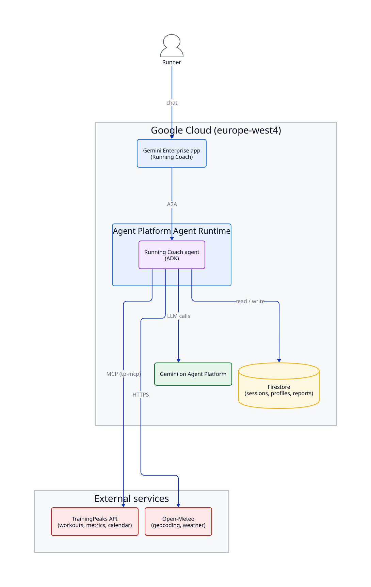
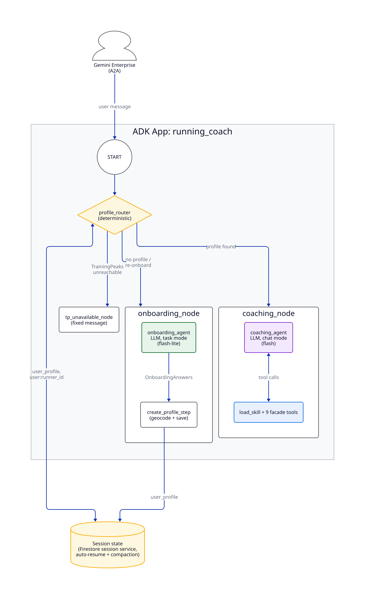
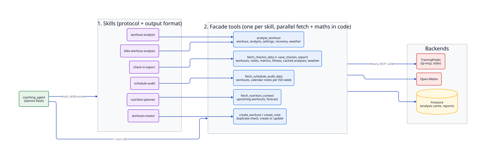
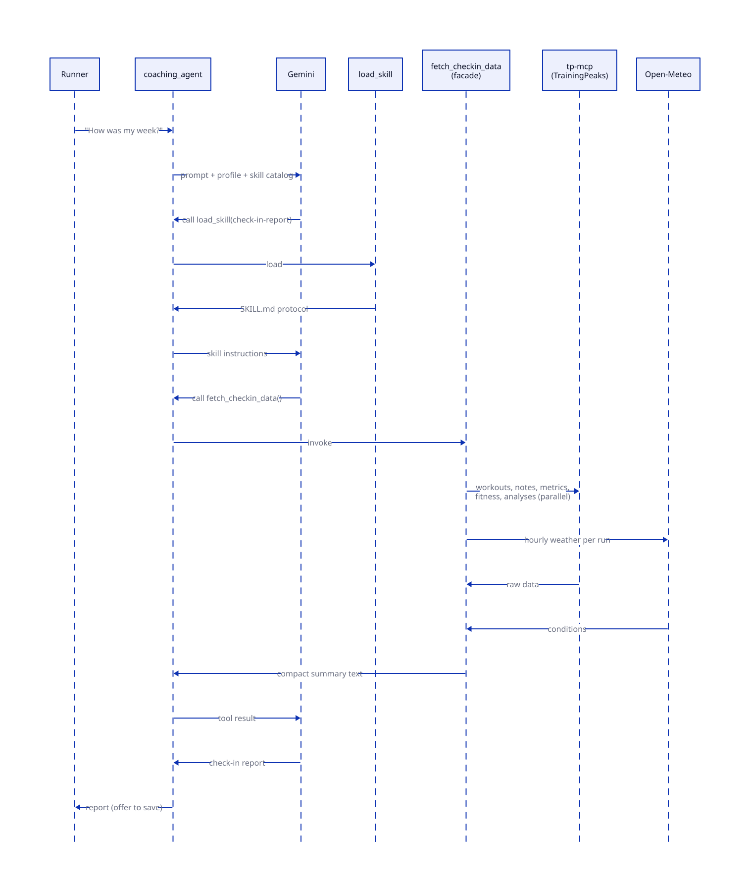
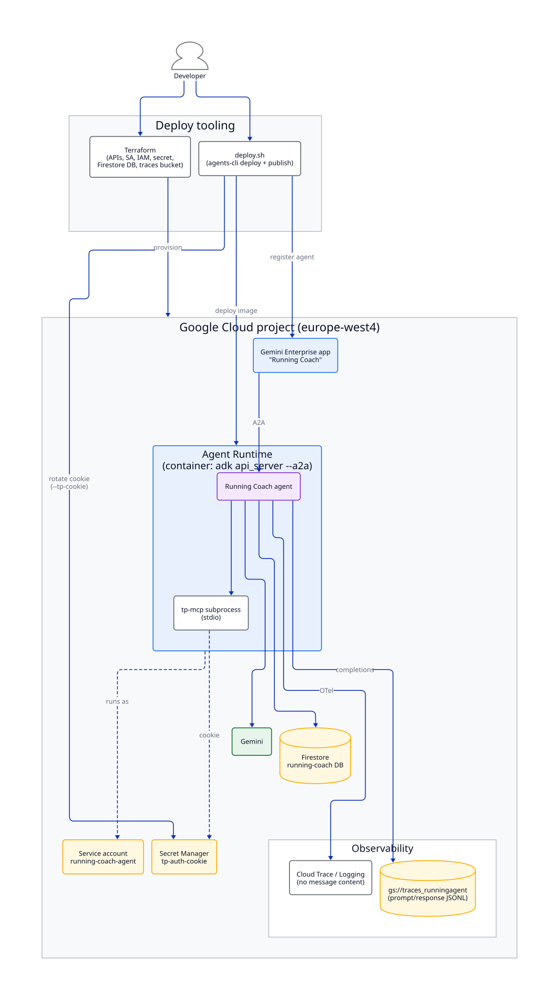

# Running Coach: Architecture

The AI Running Coach is a running coach and exercise physiologist that runners use from **Gemini
Enterprise**. It reads training data from **TrainingPeaks** and weather from **Open-Meteo**. It
keeps profiles, sessions and reports in **Firestore**, and it coaches with Gemini models.

| | |
|---|---|
| Front end | Gemini Enterprise app "Running Coach" (A2A) |
| Agent runs on | Agent Platform Agent Runtime, custom container, `europe-west4` |
| Framework | Agent Development Kit (ADK) `Workflow` |
| Models | Gemini flash (coaching), Gemini flash-lite (onboarding, history summaries) |
| Data | Firestore (`running-coach` DB), TrainingPeaks via MCP, Open-Meteo |



---

## 1. ADK workflow



The root agent is an ADK `Workflow` with one deterministic router and three nodes:

- **`profile_router`** (no LLM) works out who the runner is, from the first source that has a
  profile: session state, then the user-scoped `user:runner_id` in Firestore, then a TrainingPeaks
  profile lookup on the first session. It then routes to one node.
- **`onboarding_node`** runs `onboarding_agent` in *task mode*. The agent collects the goal, the
  race date and optional details as a structured `OnboardingAnswers` object, and it checks whether
  the goal is realistic. The node then geocodes the location and saves the profile to Firestore.
- **`coaching_node`** runs `coaching_agent` in *chat mode*. This is where the coaching happens
  (see section 2).
- **`tp_unavailable_node`** returns a fixed message when TrainingPeaks can't be reached. This stops
  a known runner from being sent back to onboarding by mistake.

**Session handling.** A custom Firestore session service automatically resumes the runner's
previous session. Every 10 turns, ADK event compaction summarises older history, so the context
doesn't grow without limit.

**Resilience.** Model calls retry on HTTP 429 with exponential backoff. The retry happens at the
model call, not at the tool, so a rate limit never replays a write such as `create_workout`.

---

## 2. Tool calling: one facade per skill



The coaching agent doesn't call the 60+ raw TrainingPeaks MCP tools directly. Instead it uses two
layers:

1. **Skills** (`skills/*/SKILL.md`) hold the protocol and output format for one task. A compact
   `SkillToolset` exposes only `load_skill`. The agent loads the matching skill before it calls any
   other tool.
2. **Facade tools** (`tools.py`): each skill has one facade function. A facade fetches everything
   the skill needs in one call. It runs the MCP calls, the weather lookups and the Firestore cache
   reads in parallel. It then does the calculations in code (decoupling, trajectory, race
   prediction, weekly buckets) and returns a compact text summary.

Why this pattern:

- **Fewer LLM turns.** One tool call replaces 5–10 raw calls.
- **Fewer tokens.** The model sees a summary, not raw JSON and time series.
- **Consistent numbers.** The maths is done in tested Python, not by the LLM.
- **Narrow write surface.** Only `create_workout`, `create_note` and `save_checkin_report` change
  any data.

A typical turn, a weekly check-in:



---

## 3. Integrations and data

- **TrainingPeaks:** the `tp-mcp` server runs as a stdio subprocess inside the container. Only
  that subprocess gets the auth cookie, which it reads from Secret Manager.
- **Open-Meteo:** geocoding (the result is cached on the profile), hourly weather at the time of
  each run, and forecasts for nutrition planning.
- **Firestore:** ADK sessions, runner profiles (`users`), check-in reports (stored per
  `week-year`) and a cache of workout analyses.

---

## 4. Deployment and security



- **Terraform** sets up the APIs, a dedicated service account (`running-coach-agent`), its
  least-privilege IAM roles, the `tp-auth-cookie` secret, the Firestore database and the traces
  bucket.
- **`deploy.sh`** uses `agents-cli`. It rotates the cookie when you pass `--tp-cookie`, deploys
  the container to Agent Runtime and registers the agent in the Gemini Enterprise app.
- **Secrets** live only in Secret Manager. The cookie is never in `.env` or the image.

## 5. Observability

- **OpenTelemetry → Cloud Trace / Logging.** Traces show end-to-end latency for the LLM,
  TrainingPeaks and weather calls.
- **Message content is kept out of traces and logs** (`NO_CONTENT`). Prompts and responses go to
  `gs://traces_runningagent/completions/` as JSONL instead.
- **Cloud Monitoring** tracks token usage (`aiplatform.googleapis.com/prediction/token_count`).

---

*Diagrams are written in d2 (`docs/diagrams/*.d2`). To regenerate them:*

```bash
cd docs/diagrams && for f in *.d2; do d2 --layout=elk "$f" "${f%.d2}.svg"; done
```
